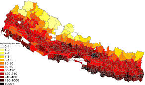

***Nepal Population Analysis Tool***

---
***Overview***  
The Nepal Population Analysis Tool is a **Command-Line Interface (CLI)-based** program designed to analyze population data from Nepalese provinces. It provides statistical insights and visualizations for predefined datasets stored as CSV files.
---
***Features & Functionalities***  
- **Load Population Data** – Read predefined datasets from CSV files.  
- **Calculate Statistics** – Compute mean, median, mode, variance, standard deviation, IQR, and MAD.  
- **Generate Visualizations** – Display histograms and distribution plots.  
- **Save Analysis** – Store results for further reference.  
- **User-Friendly CLI** – Interactive menu for easy navigation.  

---

***Technologies Used***  
- **Python Libraries**: `pandas`, `numpy`, `scipy.stats`, `matplotlib`, `seaborn`  
- **Data Processing**: CSV file handling with `pandas`  
- **Statistical Analysis**: Mean, Median, Mode, Variance, Standard Deviation  
- **Visualization**: Histograms and Kernel Density Estimation (KDE) plots  

---

***Installation & Usage***  

1. Clone the Repositor

    cmd 

    git clone https://github.com/DhawaDG/Nepal_Population_Analysis_Tool.git

    cd Nepal_Population_Analysis_Tool

3. Install Dependencies

    cmd

    pip install -r requirements.txt

3. Run the Application

    cmd

    python main.py

---

***Sample Output***

    Basic Statistics Example

    Mean: 123,456.78
    Median: 100,000.00
    Mode: 98,000.00
    Variance: 1,234,567,890.00
    Standard Deviation: 35,678.90
    IQR: 45,678.90
    MAD: 22,345.67

---

***Challenges & Solutions***

    Data Integrity – Implemented missing data checks to handle incomplete datasets.

    Performance Optimization – Used pandas.mode() for efficient mode calculation.

    Enhanced Visualization – Improved graphical representations using seaborn.

---

***Future Roadmap***

    Support for uploading custom datasets.

    Advanced statistical metrics such as Skewness and Kurtosis.

    Trend analysis and geographical visualization.

    Development of an interactive GUI or web dashboard.

---
##  **📂[EDA Projects List →](https://github.com/DhawaDG/EDA_project_summary/blob/main/README.md)** 

